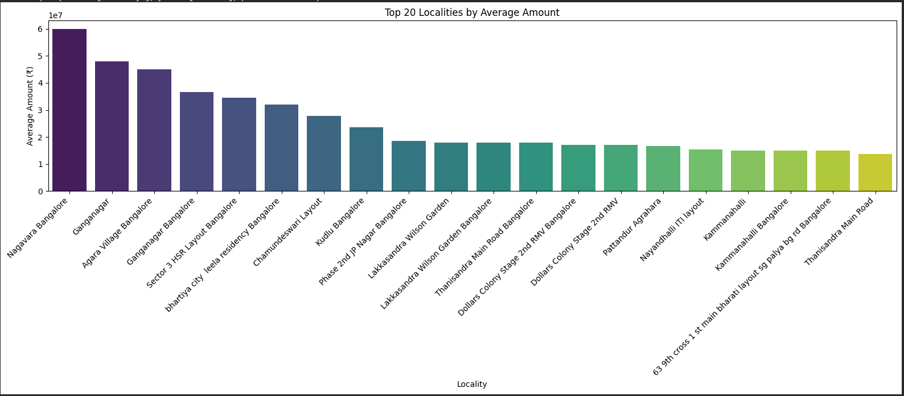
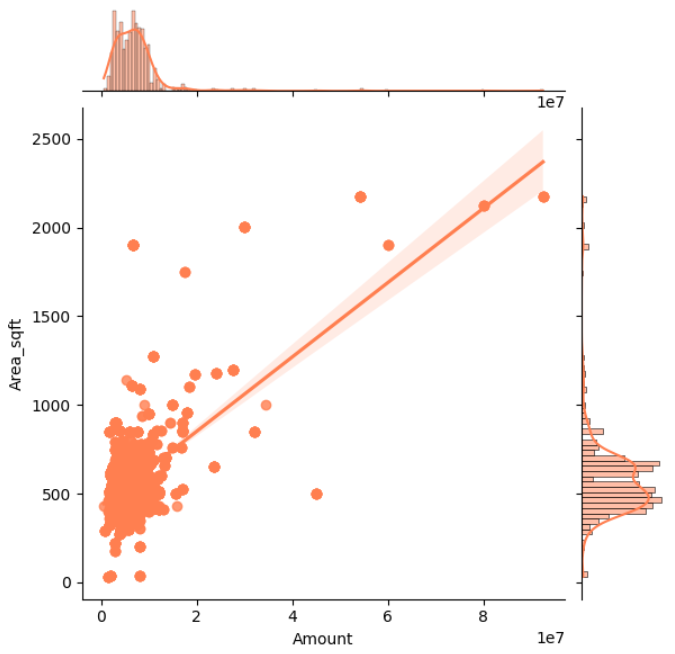

# 🏠 MagicBricks Real Estate Web Scraping & Visualization Project

**📅 Created on:** 2025-11-02  
**👨‍💻 Author:** Sourav Mondal

---

## 📘 Project Overview

This project demonstrates **end-to-end web scraping, cleaning, and visualization** of property listings from [**MagicBricks**](https://www.magicbricks.com).

It uses **Selenium** for browser automation, **BeautifulSoup** for HTML parsing, **Pandas** for data cleaning, and **Matplotlib/Seaborn** for visualization.

The notebook automates browser scrolling, scrapes multiple pages, extracts property details (price, title, location, etc.), cleans and saves data to Excel/CSV, and visualizes key insights like **price distribution**, **price vs. area**, and **top localities**.

---

## 🧠 Tech Stack & Libraries Used

- **selenium** - Browser automation and dynamic page handling
- **webdriver-manager** - Auto-handling of ChromeDriver
- **beautifulsoup4** - Parsing HTML content
- **pandas** - Data cleaning and analysis
- **matplotlib** - Static visualizations
- **seaborn** - Statistical visualizations
- **numpy** - Numerical operations
- **time** - Handling dynamic waits

---

## ⚙️ Installation & Setup

Run these commands in your environment or notebook before execution:
```bash
pip install selenium webdriver-manager beautifulsoup4 pandas matplotlib seaborn numpy
```

---

## 🚀 Workflow Summary

1. **Set Up WebDriver:** Initialize Selenium with Chrome in headless mode
2. **Scrape Listings:** Automate scrolling, pagination, and card extraction
3. **Extract Data:** Parse titles, prices, locations, details, and URLs using BeautifulSoup
4. **Clean Data:** Remove duplicates, convert price/area to numeric, handle missing values
5. **Store Output:** Save cleaned data to CSV and Excel files
6. **Visualize Insights:** Use Matplotlib & Seaborn for trend and distribution charts

---

## 📁 Project Structure
```
MagicBricks_WebScraping/
│
├── Magicbricks_webscrapping.ipynb   # Main notebook file
├── magicbricks_data.csv             # Cleaned data (output)
├── 1bhk_bengalore(1).xlsx            # Excel version of output
├── README.md                        # This file
└── requirements.txt                 # Dependencies (optional)
```

---

## 🧹 Data Cleaning Process

- Removed unwanted text symbols like ₹, commas, and unit words
- Converted price and area to numeric using regex extraction
- Trimmed whitespace and standardized text case
- Handled missing values and duplicates

---

## 💾 Data Output Schema

**Column Descriptions:**

- **Title** - Property title or headline
- **Price** - Listed price (string)
- **Price_num** - Numeric price value (converted)
- **Location** - Area / neighborhood
- **Details** - BHK, size, furnishing, etc.
- **URL** - Direct property listing link
- **Scraped_at** - Timestamp of data collection

---

## 📊 Sample Visualizations


*Distribution analysis of property prices*


          
*Joint plot showing relationship between property price and area*

----
## 🧾 Insights Gained

- Larger area properties tend to show an exponential increase in price
- Median prices vary drastically between localities like **Whitefield**, **Indiranagar**, and **Koramangala**
- Price distribution is **right-skewed** — most listings fall within affordable/mid-range, with a few luxury outliers
- Log-scaling reveals a smoother normal distribution of property values

---

## 💡 Future Enhancements

- Add **BHK-level segmentation** (e.g., 1BHK vs 3BHK)
- Integrate **geolocation mapping** using Folium or Plotly Mapbox
- Automate daily scrapes with scheduling (cron / Airflow)
- Push data to **MySQL or MongoDB** for long-term tracking
- Deploy a **Streamlit dashboard** for real-time visualization

---

## ⚠️ Ethical & Legal Notice

This project is for **educational and research purposes only.**

Always comply with MagicBricks' **Terms of Service** and **robots.txt** before scraping.

Avoid aggressive scraping (use reasonable delays, limited pages).

---

## 🧑‍💻 Author Information

**Sourav Mondal**

📧 souravmondal5f@gmail.com

🔗 [LinkedIn Profile](https://www.linkedin.com/in/sourav-mondal-7991b5373/)

---

## 📄 License

This project is open source and available for educational purposes.

---
